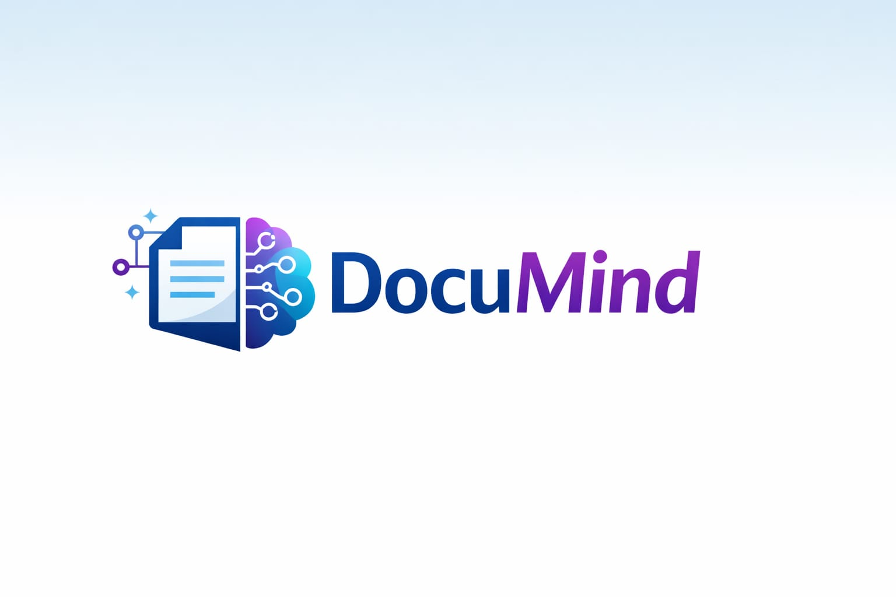
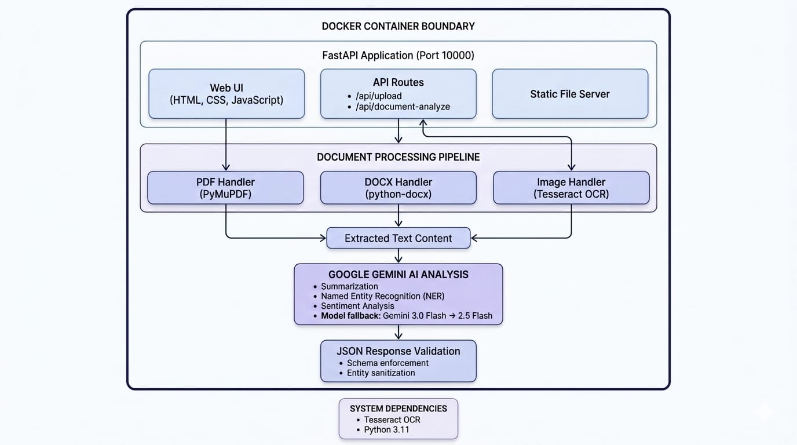

# DocuMind - AI-Powered Document Analysis API

<div align="center">
  
  <p><em>Intelligent document processing with AI-powered analysis</em></p>
</div>

## Description

An intelligent document processing API that extracts, analyses, and summarises content from PDFs, DOCX files, and images. It uses Tesseract OCR for text extraction and Google Gemini (via Google AI Studio free API) for AI-powered summarisation, named entity extraction, and sentiment analysis.

**Now containerized with Docker for seamless deployment!**

## Tech Stack

- **Framework:** FastAPI + Uvicorn
- **PDF Extraction:** PyMuPDF (fitz) — native text with OCR fallback
- **DOCX Extraction:** python-docx
- **OCR:** Tesseract via pytesseract + Pillow
- **AI Model:** Google Gemini 3.0 Flash (fallback: Gemini 2.5 Flash) via google-genai
- **Auth:** API key via x-api-key header
- **Frontend:** HTML/CSS/JS with drag-and-drop file upload
- **Deployment:** Docker containerization

## Features

✅ Web UI with drag-and-drop upload  
✅ API endpoint for programmatic access  
✅ Gemini 3.0 Flash with automatic fallback to 2.5 Flash on rate limits  
✅ JSON response validation  
✅ Local testing without API key  
✅ Docker containerization for easy deployment  

## Architecture & How It Works

<div align="center">
  
</div>

### Processing Flow

1. **Document Upload**
   - User uploads file via Web UI or sends base64-encoded file to API
   - API key authentication (skipped for localhost in development mode)
   - File type validation (PDF, DOCX, or Image)

2. **Text Extraction**
   - **PDF**: PyMuPDF extracts native text; if page is scanned, renders at 300 DPI and applies Tesseract OCR
   - **DOCX**: python-docx extracts paragraphs and table content in reading order
   - **Image**: Tesseract OCR with PSM 6 mode (uniform text block)

3. **AI Analysis**
   - Extracted text (up to 12,000 chars) sent to Google Gemini
   - Single API call performs all three tasks simultaneously:
     - **Summary**: 1-3 sentence document overview
     - **Entity Extraction**: Names, dates, organizations, monetary amounts
     - **Sentiment**: Positive/Negative/Neutral
   - Automatic fallback from Gemini 3.0 Flash to 2.5 Flash on rate limits

4. **Response Validation**
   - JSON schema validation ensures consistent output format
   - Entity sanitization and type checking
   - Error handling for malformed AI responses

5. **Return Results**
   - Structured JSON response with status, summary, entities, and sentiment
   - HTTP error codes for authentication, validation, or processing failures

### Authentication Model

**Development Mode** (`ENVIRONMENT=development`):
- Web UI: No API key required for localhost
- `/api/upload-test`: No API key for localhost requests
- `/api/document-analyze`: API key required (even locally)

**Production Mode** (`ENVIRONMENT=production`):
- All endpoints require valid API key in `x-api-key` header
- 401 Unauthorized on missing/invalid key

## AI Tools Used

This project was developed with assistance from:
- **GitHub Copilot** - AI-powered development assistant
  - Claude Opus 4.5 (for complex architecture and design decisions)
  - Claude Sonnet 4.5 (for implementation and optimization)


## Setup Instructions

### Option 1: Docker (Recommended)

#### 1. Clone the repository
```bash
git clone <your-repo-url>
cd guvi-hack
```

#### 2. Create environment file
```bash
cp .env.example .env
# Edit .env and set:
# - API_KEY=your_secret_key_for_api_access
# - GEMINI_API_KEY=your_gemini_api_key
# - ENVIRONMENT=development (for local) or production (for deploy)
```

#### 3. Build and run with Docker
```bash
# Build the Docker image
docker build -t guvi-document-analyzer .

# Run the container
docker run -d \
  -p 10000:10000 \
  --env-file .env \
  --name doc-analyzer \
  guvi-document-analyzer
```

#### 4. Access the application
Open your browser and navigate to: `http://localhost:10000`

#### Docker Management Commands
```bash
# Stop the container
docker stop doc-analyzer

# Start the container
docker start doc-analyzer

# View logs
docker logs doc-analyzer

# Remove container
docker rm doc-analyzer

# Remove image
docker rmi guvi-document-analyzer
```

### Option 2: Local Installation (Without Docker)

#### 1. Clone the repository
```bash
git clone <your-repo-url>
cd guvi-hack
```

#### 2. Install dependencies
```bash
pip install -r requirements.txt
```

#### 3. Install Tesseract OCR (system dependency)
```bash
# Ubuntu / Debian
apt install tesseract-ocr

# macOS
brew install tesseract

# Windows — download installer from:
https://github.com/UB-Mannheim/tesseract/wiki
```

#### 4. Set environment variables
```bash
cp .env.example .env
# Edit .env and set:
# - API_KEY=your_secret_key_for_api_access
# - GEMINI_API_KEY=your_gemini_api_key
# - ENVIRONMENT=development (for local) or production (for deploy)
```

#### 5. Run the application
```bash
uvicorn src.main:app --host 0.0.0.0 --port 8000 --reload
```

Then open: http://localhost:8000

## Deployment

### Docker Deployment (Recommended)

Docker simplifies deployment by packaging the application with all dependencies.

#### Deploy to Docker-compatible host

```bash
# On your server
git clone <your-repo>
cd guvi-hack

# Create .env file with production values
echo "API_KEY=your_key" > .env
echo "GEMINI_API_KEY=your_gemini_key" >> .env
echo "ENVIRONMENT=production" >> .env

# Build and run
docker build -t doc-analyzer .
docker run -d -p 10000:10000 --env-file .env --name doc-analyzer doc-analyzer
```

**Port Configuration:**
- Dockerfile exposes port 10000 by default
- Access the application at `http://your-server-ip:10000`

### Traditional Deployment (Without Docker)

If you prefer traditional deployment without Docker:

#### Environment Variables to Set:
```
API_KEY=your_secret_api_key_here
GEMINI_API_KEY=your_gemini_api_key_from_ai_studio
ENVIRONMENT=production
```

#### Build Command:
```bash
pip install -r requirements.txt
```

#### Start Command:
```bash
uvicorn src.main:app --host 0.0.0.0 --port 10000
```

**System Dependencies Required:**
- Tesseract OCR


## API Documentation

### Authentication

**Development Mode** (`ENVIRONMENT=development`):
- **Web UI** (`/`): Works without API key ✅
- **Upload endpoint** (`/api/upload-test`): No API key needed ✅
- **API endpoint** (`/api/document-analyze`): Requires API key ✅

**Production Mode** (`ENVIRONMENT=production`):
- **Web UI** (`/`): Requires API key in input field ✅
- **Upload endpoint** (`/api/upload-test`): Requires API key in header ✅
- **API endpoint** (`/api/document-analyze`): Requires API key in header ✅

### Endpoints

#### Endpoint 1: Web Upload (for testing)
```
POST /api/upload-test
```

**Headers:**
```
x-api-key: <your API_KEY> (required in production)
```

**Body:** multipart/form-data with `file` field

**Example cURL:**
```bash
curl -X POST https://your-app.example.com/api/upload-test \
  -H "x-api-key: your_api_key" \
  -F "file=@document.pdf"
```

#### Endpoint 2: Base64 JSON 
```
POST /api/document-analyze
```

**Headers:**
```
Content-Type: application/json
x-api-key: <your API_KEY>
```

**Request Body:**
```json
{
  "fileName": "sample1.pdf",
  "fileType": "pdf",
  "fileBase64": "<base64 encoded file content>"
}
```

**Supported fileType values:** `pdf`, `docx`, `image`

**Example cURL:**
```bash
curl -X POST https://your-app.example.com/api/document-analyze \
  -H "Content-Type: application/json" \
  -H "x-api-key: your_api_key" \
  -d '{
    "fileName": "invoice.pdf",
    "fileType": "pdf",
    "fileBase64": "<base64string>"
  }'
```

#### Success Response
```json
{
  "status": "success",
  "fileName": "sample1.pdf",
  "summary": "This document is an invoice issued by ABC Pvt Ltd to Ravi Kumar on 10 March 2026 for an amount of ₹10,000.",
  "entities": {
    "names": ["Ravi Kumar"],
    "dates": ["March 2026"],
    "organizations": ["ABC Pvt Ltd"],
    "amounts": ["₹10,000"]
  },
  "sentiment": "Neutral"
}
```

#### Error Responses
| Status | Reason |
|--------|--------|
| 401 | Missing or invalid x-api-key |
| 400 | Unsupported fileType or bad base64 |
| 422 | No text could be extracted |
| 502 | Gemini AI analysis failed |

## Technical Details

### Text Extraction Strategy

| File Type | Extraction Method |
|-----------|------------------|
| **PDF** | PyMuPDF extracts native text; scanned pages rendered at 300 DPI with Tesseract OCR |
| **DOCX** | python-docx extracts paragraphs and table content in reading order |
| **Image** | Tesseract OCR with PSM 6 mode (uniform text block) |

### AI Analysis Strategy

- **Single API Call**: All three tasks (summary, entities, sentiment) processed simultaneously
- **Primary Model**: Gemini 3.0 Flash (fast, efficient)
- **Fallback Model**: Gemini 2.5 Flash (automatic on rate limits)
- **Token Limit**: 12,000 characters per analysis
- **Response Validation**: JSON schema enforcement with entity sanitization

### Docker Architecture

**Base Image**: `python:3.11-slim`
- Minimal Debian-based image (~150MB)
- Python 3.11 and pip included

**System Dependencies**:
- `tesseract-ocr`: OCR engine for scanned documents

**Application Structure**:
```
/app
├── src/
│   └── main.py          # FastAPI application
├── static/
│   ├── index.html       # Web UI
│   ├── script.js        # Frontend logic
│   └── style.css        # Styling
├── requirements.txt     # Python dependencies
├── Dockerfile           # Container build instructions
└── .dockerignore        # Files to exclude from build
```

**Port Configuration**:
- Container exposes port 10000
- Uvicorn binds to 0.0.0.0:10000 for external access

### Why Docker?

✅ **Consistency** - Same environment in development and production  
✅ **Portability** - Works on any Docker-compatible host  
✅ **Isolation** - Dependencies don't conflict with host system  
✅ **Easy Scaling** - Spin up multiple containers for load balancing  
✅ **Simplified Setup** - All system dependencies bundled in container  

---

## 👨‍💻 Author

**Mubendiran K**  
Rajalakshmi Institute of Technology, Chennai  
Built as part of **GUVI Hackathon 2026** submission

## 🎥 Project Demo

Watch the full video demo of **DocuMind** below:

🔗 **YouTube Demo:**  
https://youtu.be/tMJi5EOxsNE